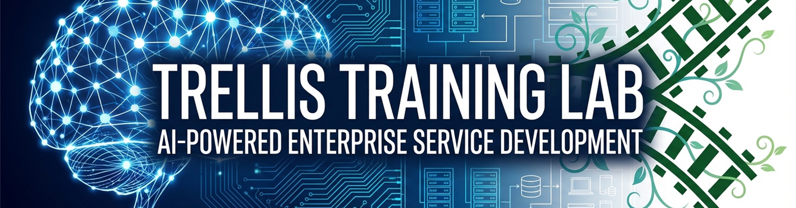
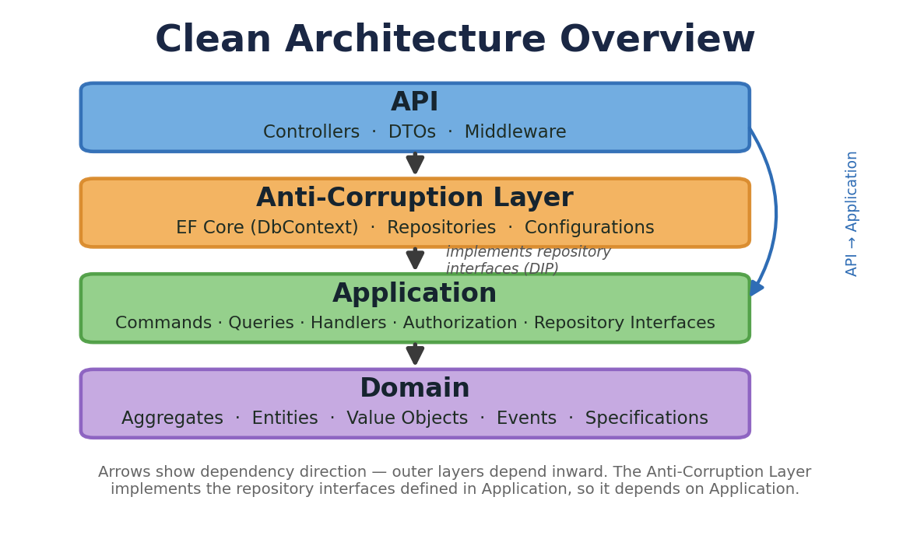
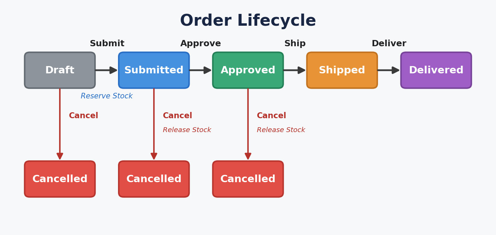
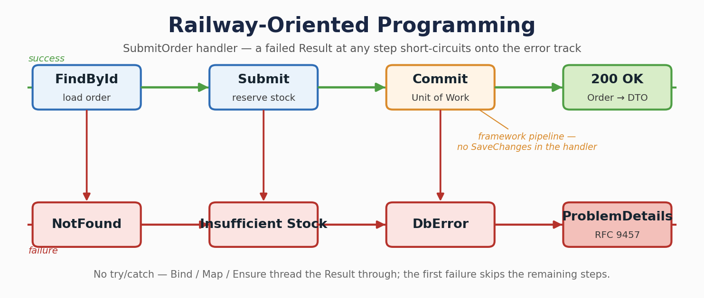
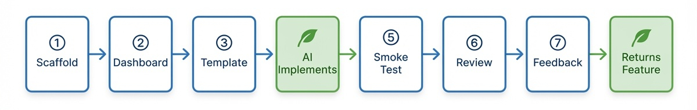
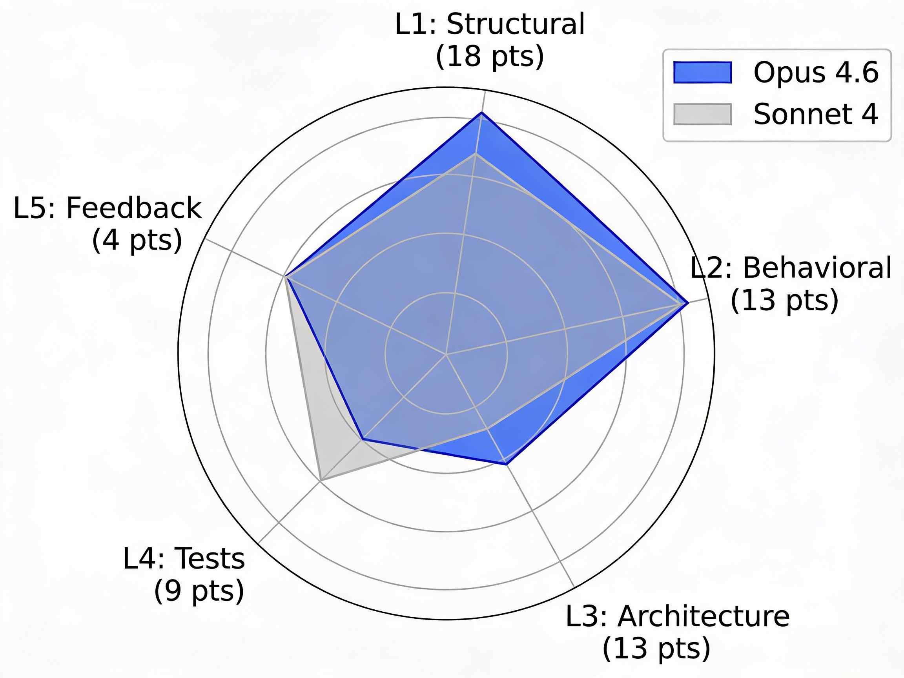
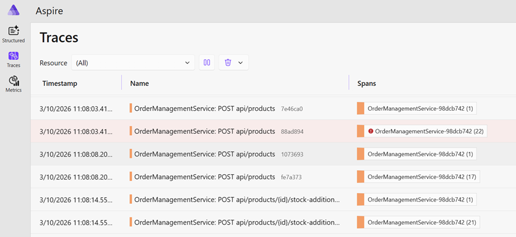
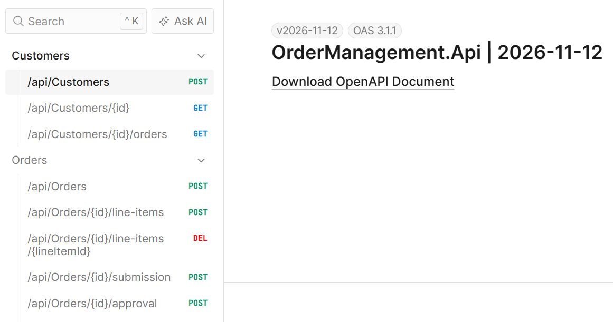

<p align="center">
  
</p>

# Trellis Training Lab Corpus

[](docs/training-lab.md)
[](LICENSE)
[](https://dotnet.microsoft.com/download)
[](https://docs.microsoft.com/en-us/dotnet/csharp/)
[](https://github.com/xavierjohn/Trellis-training/stargazers)

> Build enterprise services with AI — and measure consistency across system shapes.

This repository is a **lab corpus**: a growing collection of business specs that the AI implements end-to-end against the [Trellis framework](https://github.com/xavierjohn/Trellis) + a template. Each lab targets a different system shape (HTTP CRUD, background worker, unversioned redirect host, …). Each run is scored against a per-lab coverage checklist.

The corpus is intentionally heterogeneous. **Single-lab benchmarks only tell you whether AI does *that one shape* consistently** — not whether Trellis is consistent across shapes. The corpus exists so framework feedback isn't biased toward whatever lab was written first.

This isn't a tutorial — it's a **training lab + AI consistency benchmark**.

---

<p align="center">
  
</p>

## Lab catalog

| Lab | System shape | Spec | Checklist | Operator guide |
|---|---|---|---|---|
| **Order Management** | CRUD + state machine + versioned API + EF Core | [`specs/order-management.md`](specs/order-management.md) | embedded in operator guide | [`docs/training-lab.md`](docs/training-lab.md) |
| **Subscription Reminder Worker** | `BackgroundService` + scheduled work + non-HTTP pipeline + cross-pipeline actor composition | [`specs/subscription-reminder-worker.md`](specs/subscription-reminder-worker.md) | [`specs/coverage-checklist-subscription-reminder.md`](specs/coverage-checklist-subscription-reminder.md) | [`docs/training-lab-worker.md`](docs/training-lab-worker.md) |
| **URL Shortener** | Unversioned HTTP surface + write-then-redirect + `Idempotency-Key` + ETag + anonymous redirect alongside permission-gated CRUD | [`specs/url-shortener.md`](specs/url-shortener.md) | [`specs/coverage-checklist-url-shortener.md`](specs/coverage-checklist-url-shortener.md) | (TBD — open issue) |

Each lab exercises a distinct slice of the Trellis surface area. Framework friction surfaced by one lab feeds the per-lab `TRELLIS_FEEDBACK.md`; recurring friction across labs becomes the prioritised framework backlog.

<p align="center">
  
</p>

## What you're measuring

You're **not** measuring whether AI can write code. You're measuring whether **Trellis constrains the AI enough** that independent runs produce the same architecture, the same patterns, and the same error handling — across labs that exercise different framework surfaces.

Where independent runs diverge, Trellis needs a tighter building block. Where divergence is consistent across labs, the framework has a structural gap. Where divergence appears in only one lab, it's a lab-specific edge case (or a lab-specific spec ambiguity).

<p align="center">
  
</p>

## How a lab works

Each lab follows the same 8-step procedure. The OM lab's `docs/training-lab.md` is the canonical reference; lab-specific operator guides (e.g. `docs/training-lab-worker.md`) add or override per-lab steps where the system shape requires it.

<p align="center">
  
</p>

| Step | What happens | Time |
|------|-------------|------|
| **1** | Create project directory | 1 min |
| **2** | Start Aspire Dashboard for observability | 2 min |
| **3** | Scaffold with `dotnet new trellis-asp` (or `dotnet new trellis-microservices` for multi-service labs) | 2 min |
| **4** | Paste lab spec + checklist into Copilot — AI implements everything | 10-30 min |
| **5** | Manual smoke test (`.http` file for HTTP labs; `/health` polling for worker labs) | 5 min |
| **6** | Review generated code | 5 min |
| **7** | AI generates `TRELLIS_FEEDBACK.md` | 2 min |
| **8** | AI adds an incremental feature (OM: Order Returns; worker: SLA policy override; URL shortener: bulk-import endpoint) | 10-15 min |

**Total: ~45 minutes per run.** The per-lab operator guide names the lab-specific Step 4 attachments, Step 5 smoke verification, and Step 8 feature addition.

## Evaluation

Each lab is scored against its own checklist. The OM lab uses the original 57-criteria rubric (`docs/training-lab.md`); the worker and URL-shortener labs use a shape-specific per-row checklist (`specs/coverage-checklist-*.md`).

<p align="center">
  
</p>

| Level | What it measures | OM rows |
|-------|-----------------|---------|
| **L1: Structural** | Are the right types, patterns, and building blocks present? | 18 |
| **L2: Behavioral** | Does the business logic work correctly? | 13 |
| **L3: Architecture** | Is the API, DI, and infrastructure correct? | 13 |
| **L4: Tests** | Are domain, integration, and auth tests comprehensive? | 9 |
| **L5: Feedback** | Did the AI produce useful framework feedback? | 4 |

**Passing score (OM lab): 52+/57.** Per-lab thresholds are documented in each operator guide.

### Order Management baselines — Trellis `3.0.0-alpha.360` (2026-06-08, rescored after L2.11 rubric fix)

| AI Model | Score | Verdict |
|----------|-------|---------|
| Claude Opus 4.8 | 56/57 (98%) | **PASS** |
| Claude Sonnet 4.6 | 56/57 (98%) | **PASS** |
| Claude Opus 4.7 (1M ctx) | 55/57 (96%) | **PASS** |
| GPT-5.5 | 54/57 (95%) | **PASS** |
| Claude Haiku 4.5 | 43/57 (75%) | **FAIL** |

Top four cluster 54–56/57. The rubric's **L2.11** was rewritten in this PR — it previously asked for `ParallelAsync` on the draft-order load, which contradicted cookbook Recipe 21 (parallelizing two repos that share a scoped `DbContext` races EF Core). All five models had used the framework-correct batched load (`FindManyByIdAsync`), so the fix produced +1 each. **Opus 4.8** was the only model to flag the contradiction in its TRELLIS_FEEDBACK before the fix; **Sonnet 4.6** was the only model to use both `Trellis.Testing` assertion extensions (`.Should().BeSuccess()` AND `.Should().HaveValue()`) systematically. Reference run on disk: [`after/OrderManagement/`](after/OrderManagement/) (Opus 4.7 1M).

**Historical (alpha.104/106) for diff reference only — kept in [results/evaluation-results.md](results/evaluation-results.md):** Opus 4.6 53/57 PASS · Sonnet 4.6 55/57 PASS · GPT-5.4 45/57 FAIL. Direct cross-era comparison isn't apples-to-apples because the v4 typed-accessor pattern, the `Trellis.Mediator.FluentValidation` package split, and the `Error.Conflict` reason-code requirement all changed underneath the rubric.

Full per-model scorecards with criterion-by-criterion findings: **[results/evaluation-results.md](results/evaluation-results.md)**. Mistakes pattern log: **[results/ai-mistakes-log.md](results/ai-mistakes-log.md)**.

## Observability

Every lab includes Aspire Dashboard integration for real-time traces, metrics, and structured logs.

<p align="center">
  
</p>

API documentation is served via Scalar for the HTTP labs:

<p align="center">
  
</p>

## Prerequisites

- GitHub Copilot access (Copilot Chat in VS Code) or another AI model you want to benchmark
- .NET 10 SDK
- VS Code or Visual Studio
- Docker Desktop (optional — for Aspire Dashboard)
- Trellis ASP template: `dotnet new install Trellis.AspTemplate`
- Trellis Microservices template (for future multi-service labs): `dotnet new install Trellis.Microservices.Templates`

## Quick Start

```bash
# 1. Clone this repo
git clone https://github.com/xavierjohn/Trellis-training.git

# 2. Install the templates
dotnet new install Trellis.AspTemplate
dotnet new install Trellis.Microservices.Templates

# 3. Pick a lab
#    - HTTP CRUD + state machine: docs/training-lab.md (Order Management)
#    - Background worker:         docs/training-lab-worker.md (Subscription Reminder)
#    - Unversioned HTTP redirect: specs/url-shortener.md (operator guide TBD)

# 4. Follow the operator guide Steps 1-8
```

## Repository Structure

```
Trellis-training/
├── README.md                                            # This file
├── docs/
│   ├── training-lab.md                                  # OM lab — operator guide + rubric
│   ├── training-lab-worker.md                           # Subscription-reminder worker — operator guide
│   └── images/                                          # Visual assets
├── specs/                                               # Lab specs (paste into Copilot)
│   ├── order-management.md
│   ├── subscription-reminder-worker.md
│   ├── coverage-checklist-subscription-reminder.md
│   ├── url-shortener.md
│   └── coverage-checklist-url-shortener.md
├── results/
│   ├── evaluation-results.md                            # Historical scorecards (OM lab)
│   └── ai-mistakes-log.md                               # Common mistake patterns
├── before/
│   └── OrderManagement/                                 # Template scaffold (what you start with)
└── after/
    └── OrderManagement/                                 # Reference implementation (what AI builds)
```

## Related repositories

- [`xavierjohn/Trellis`](https://github.com/xavierjohn/Trellis) — the framework being benchmarked: `Result<T>`, `Maybe<T>`, value objects, DDD primitives, ASP.NET / EF Core / Mediator integration.
- [`xavierjohn/Trellis.AspTemplate`](https://github.com/xavierjohn/Trellis.AspTemplate) — `dotnet new trellis-asp` single-service Clean Architecture template used by the OM, worker, and URL-shortener labs.
- [`xavierjohn/Trellis.Microservices`](https://github.com/xavierjohn/Trellis.Microservices) — microservice trust-boundary packages: YARP gateway + consumer-side actor provider.
- [`xavierjohn/Trellis.Microservices.Template`](https://github.com/xavierjohn/Trellis.Microservices.Template) — `dotnet new trellis-microservices` multi-service Project Tracker template. A future multi-service lab will benchmark AI consistency across the gateway + downstream services topology.
- [`xavierjohn/Trellis.ServiceLevelIndicators`](https://github.com/xavierjohn/Trellis.ServiceLevelIndicators) — latency SLI metrics library. The OM and URL-shortener labs already emit `Trellis.SLI`-shaped metrics via the framework's middleware.

## License

[MIT](LICENSE)

---

<p align="center">
  <b>Built with <a href="https://github.com/xavierjohn/Trellis">Trellis</a></b> — the framework for building enterprise .NET services with AI.
</p>