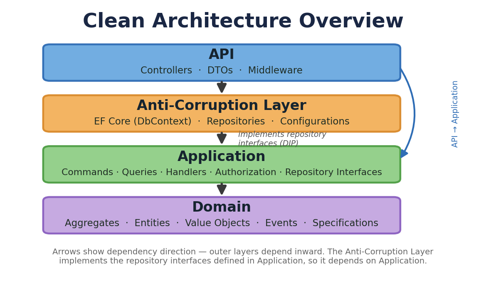
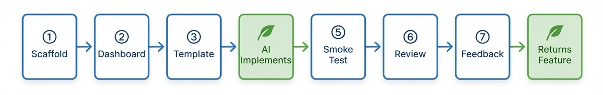

# Trellis Training Lab — URL Shortener

> **Learn how Trellis handles an unversioned HTTP service** — permission-gated CRUD, anonymous redirects, resource-aware idempotent POST, and ETag-cached reads. Use the common `Trellis.Asp` Location/pagination helpers without installing the optional versioning SDK.
>
> 🧪 Like every lab here, it doubles as an [AI-consistency eval](#running-this-as-a-consistency-eval-optional). If you're here to learn, just follow the steps.

> **Do the [Order Management lab](training-lab.md) first.** It teaches the Trellis fundamentals — `Result<T>`/ROP, `Maybe<T>`, value objects, Clean Architecture, CQRS, testing — that this lab assumes. This guide focuses only on what's *new* about the URL-shortener shape.

---

## Who this is for

A developer who has finished the OM lab and wants to see Trellis applied to a **mixed, unversioned HTTP surface**. There's no reference build checked in for this lab (the OM lab is your reference for the shared patterns); here, the [spec](../specs/url-shortener.md) is the source of truth and you learn by reading what the AI produces against it.

## What you'll build

An internal URL shortener: authenticated users mint short codes for long URLs; **anyone** (including anonymous visitors) can follow a short URL and get a `302` redirect; owners see click stats and can disable, extend, or delete their links; an admin permission manages any link. SQLite persistence, full test suite — **no API versioning at the host level.**

## What you'll learn

- **Common HTTP helpers without a versioning dependency** — `HttpContext.PageUrl`, `CreatedAtRoute` and `WithLocation` emit plain, dereferenceable links. The alpha.557 course replaces the old optional-versioning-helper exercise with this package-independent surface.
- Hosting an **anonymous redirect alongside permission-gated CRUD** in one app, including route precedence.
- **Idempotent `POST`** via the `Idempotency-Key` header, a `(OwnerId, Key)` unique constraint, and canonical-body comparison.
- **Existence-leak protection** — returning `404`, not `403`, for resources you don't own.
- **ETag / `If-None-Match` → `304`** on a cached read, with authorization checked *before* the ETag.
- **Cursor pagination** with `Page<T>` and `HttpContext.PageUrl`.
- The wider **`Error` taxonomy** — especially `Error.Gone → 410` for disabled/expired links (never collapsed into `404`).

---

## Core concepts you'll meet *(new vs. the OM lab)*

You already met `Result<T>`, `Maybe<T>`, value objects, Clean Architecture, CQRS, and `Trellis.Testing` in the [OM lab](training-lab.md#core-trellis-concepts-youll-meet). These are the shape-specific additions:

| Concept | What it is | Why it's the point of this lab |
|---|---|---|
| **Versioning-free HTTP helpers** | `UseAsp()` plus common `PageUrl`/Location builders; no versioning packages or policies. | Ordinary unversioned links should need neither hand-built URLs nor an unused SDK. |
| **Mixed surface + route precedence** | A wildcard `GET /{shortCode}` at the root sits next to literal routes `/links`, `/links/{id}`, `/health`. | Literal/longer routes must win over the single-segment wildcard (default ASP.NET precedence) so the redirect never shadows the API. `ShortCode` even forbids reserved segments (`links`, `health`). |
| **Resource-aware idempotent `POST`** | A per-owner key record, canonical request and atomic ACL persistence. | Same key/body → 200 with the current LinkView while it exists, reflecting disable/expiry changes; after deletion → 404 without recreating it. A new key represents a new creation. The standard response-cache middleware has a different contract. |
| **Existence hiding** | Static operation permissions plus `HideExistence<Link>()`, shared loader and actor/resource handler bases. | Anonymous → 401; missing base permission → 403; otherwise permitted non-owner → stable hidden 404. Use deny-aware `HasPermission`. |
| **ETag caching** | `GET /links/{id}/stats` returns a strong `ETag`; `If-None-Match` → `304` with no body. | Saves bandwidth on polling clients — and **authorization runs before the ETag**, so a non-owner always gets `404`, never a `304` they could use to probe existence. |
| **Cursor pagination** | Raw `TryCreatePageRequest` → `PageRequest` → typed seek → `PagedResponse<LinkView>` and `Link` header. | Empty/repeated cursors and malformed limits yield coded query-location 422 errors; `CreatedAt DESC, Id DESC` provides a unique tie-breaker. |
| **`Error.Gone` → `410`** | Disabled or expired links surface `new Error.Gone(ResourceRef.For<Link>(shortCode))`. | The full `Error` taxonomy maps to correct HTTP via Problem Details. Collapsing `410` into `404` hides the lifecycle signal and is wrong. |
| **Redirect resilience** | Recording a click must never change the redirect's status code. | The orchestrator wraps the click insert in `try/catch`, logs at Warning, and still returns the `302`/`410` — availability of the redirect beats click bookkeeping. |

<p align="center">
  
</p>

---

## Prerequisites

Same as the [OM lab](training-lab.md#prerequisites). The Aspire Dashboard (Step 2 there) is optional — this lab is request-driven, so a `.http` file is enough to exercise it.

## The workflow

The same 8-step shape as every lab, with two differences: there's **no incremental-feature step** (this lab is single-shot — see the note at Step 7), and Step 4 attaches *two* files (spec + coverage checklist).

<p align="center">
  
</p>

## Step 1 — Create a project directory

```bash
mkdir UrlShortener && cd UrlShortener && git init
```

## Step 2 — (optional) Start the Aspire Dashboard

Only if you want to watch traces/metrics — see [OM Step 2](training-lab.md#step-2-start-the-aspire-dashboard). Skip it and the lab still works.

## Step 3 — Scaffold

```bash
dotnet new install Trellis.Asp.Templates@1.0.151-alpha
dotnet new trellis-asp -n UrlShortener --author-name "Your Name" --api-versioning false
dotnet build && dotnet test --solution UrlShortener.slnx
dotnet agentdocs check --strict
git add -A && git commit -m "Scaffold with Trellis template"
```

> **The current template defaults to unversioned.** Keep that profile; don't add dated namespaces, versioning packages, registration or URL policy. Start at `AGENTS.md` and its AgentDocs index; after changing packages, restore and sync the solution's guidance.

## Step 4 — Implement the service

Open Copilot Chat and **attach two files** (paperclip — don't paste the bodies): [`specs/url-shortener.md`](../specs/url-shortener.md) as `SPEC.md` and [`specs/coverage-checklist-url-shortener.md`](../specs/coverage-checklist-url-shortener.md) as `COVERAGE.md`. Then send:

> Implement the URL Shortener according to SPEC.md and COVERAGE.md. Read AGENTS.md, the required AgentDocs router and selected recipes directly. Keep the unversioned profile and use common Trellis.Asp Location/PageUrl helpers. Use raw TryCreatePageRequest parsing, typed seeks, actor/resource-aware handler bases and HideExistence. Preserve atomic Link+key creation, live replay as the current LinkView, and key tombstones after deletion: an old-key matching retry returns 404, different-body replay stays 409, and a new key creates a new link. Every row in §1–§9 of COVERAGE.md needs a matching assertion.

Let it work and resolve genuine business ambiguities. Then run `dotnet build && dotnet test --solution UrlShortener.slnx`, pasting back errors until clean.

## Step 5 — Smoke test

Run the service (`dotnet run --project Api/src`) and drive it with the generated `.http` file. Walk the surface — each line maps to a concept above:

1. **Create a link** (actor with `links:create`) → `201` + `Location: /links/{id}` with **no** `?api-version=`
2. **Re-POST with the same `Idempotency-Key` and body** → `200` (same link, not a new one); **different body, same key** → `409`
3. **Follow the short code** `GET /{shortCode}` (no auth header) → `302` to the original URL
4. **Disable it**, then follow again → `410 Gone`; follow an unknown code → `404`. Replay the original creation request → `200` with the current disabled LinkView, not the original active view.
5. **List** `GET /links` → the `Link: …; rel="next"` header carries **no** `?api-version=`
6. **Stats** `GET /links/{id}/stats` twice with `If-None-Match` → second is `304`; a **non-owner** gets `404`, never `304`
7. **Health** `GET /health` (anonymous) → `200`
8. **Delete a keyed link**, then replay the original key/body → `404`, no new link. Repeat with a new key → `201`.

## Step 6 — Read and review — *the learning*

Check the generated code against [What "good" looks like](#what-good-looks-like-and-why). The OM lab's [guided-tour](training-lab.md#guided-tour-of-the-reference-implementation) order still applies (`Domain → Application → Acl → Api`); the new things to look for here are the unversioned-host wiring, the idempotency handler, and the redirect orchestrator. Commit your review.

## Step 7 — Generate Trellis feedback

Same as [OM Step 7](training-lab.md#step-7-generate-trellis-feedback): have Copilot produce `TRELLIS_FEEDBACK.md`. Distinguish actual API gaps from reimplemented shipped helpers.

> **No Step 8.** Unlike the OM lab, this lab is **single-shot** — the spec defines no incremental feature, so there's no architecture-evolution step. (A natural stretch, if you want one: add link tags or a per-owner rename. Not scored.)

---

## What "good" looks like (and why)

Your definition of done for Step 6. (When you run this as an eval, these become scored rows — the binding matrix is the [coverage checklist](../specs/coverage-checklist-url-shortener.md).)

**Unversioned-host contract — the headline:**
- Neither `Program.cs` nor `Api/src/DependencyInjection.cs` calls `AddApiVersioning(...)`; no route template contains `:apiVersion`; every endpoint is reachable with **no** `?api-version=`. *Why:* the whole lab is "does Trellis behave in a host that never opted into versioning?"
- Creation and disable Locations use common named-route builders and dereference to the intended resource; there is no version-aware chain or optional SDK dependency.
- The `GET /links` `Link: …; rel="next"` header comes from `HttpContext.PageUrl(...)` and carries no `api-version`. *Why:* proves `PageUrl` composes cleanly with no version metadata.

**Domain & behavior:**
- `ShortCode` (4–12 chars, `[A-Za-z0-9_-]`, rejects reserved `links`/`health`), `OriginalUrl` (absolute http/https, ≤2048), `IdempotencyKey`, `UserAgent`, `RefererHost` are all value objects validating in `TryCreate`.
- `Link.Disable`/`Enable` are **idempotent** — the second call is a no-op success and raises **no** event. `Extend` rejects a new expiry not strictly later than the current one (and now).
- `OwnerId`, `ShortCode`, `OriginalUrl` are immutable after creation.
- Redirect eligibility (`IsActive && (ExpiresAt is None || ExpiresAt > now)`) is **computed, not stored**; `Expired` is not a state.

**HTTP & cross-cutting:**
- Non-owner without `links:admin` → `404` (not `403`) everywhere, including `/stats`. *Why:* no existence leak.
- `GET /{shortCode}`: `302` eligible · `410` disabled/expired (`Error.Gone`) · `404` unknown — all anonymous.
- A click row is written on `302` only — never on `410`/`404` — and a click-insert failure does **not** change the redirect status.
- `Idempotency-Key` uniqueness is a database constraint handled in an ACL atomic persistence boundary (replay 200 / mismatch 409 / deleted target 404); deleting the link retains its key record.
- `GET /links` uses `TryCreatePageRequest(max: 100, defaultSize: 50, policy: PageSizeLimitPolicy.Reject)`; invalid raw cursor/limit and out-of-range values return coded 422 errors. Stats checks authorization before 304.
- Error taxonomy maps correctly: `401` / `403` / `422` (invalid input) / `409` (conflict) / `404` / `410` / `503` (code-generation exhausted).

**Tests:** applicable value-object rules, replay/mismatch/deleted-target cases, stable missing/withheld 404 fields, redirects, dereferenceable Location/next links, raw pagination failures and real-SQLite atomicity/uniqueness. Test handlers through real Mediator dispatch; code searches alone prove none of these behaviors.

---

## Running this as a consistency eval *(optional)*

Same methodology as the [OM lab](training-lab.md#running-this-as-a-consistency-eval-optional): run Steps 1–7 in N fresh sessions, score each against the [coverage checklist](../specs/coverage-checklist-url-shortener.md), and treat any criterion that fails in more than ~30% of runs as a framework/instruction gap. The most informative axes for this shape:

- Did the AI keep the host unversioned and use common PageUrl/Location builders without optional dependencies?
- Did it keep atomic key+Link creation, handle database races and retain deleted-link key tombstones?
- Did it use actor/resource-aware handler bases and `HideExistence<Link>()`, rather than provider plumbing and fallback reloads?
- Did it surface `Error.Gone → 410`, or collapse disabled/expired into `404`?

---

## Where to go next

- The [Subscription Reminder Worker](training-lab-worker.md) lab — the non-HTTP `BackgroundService` shape.
- The [Order Management](training-lab.md) lab — the canonical fundamentals, if you skipped it.
- The framework: [`xavierjohn/Trellis`](https://github.com/xavierjohn/Trellis).
