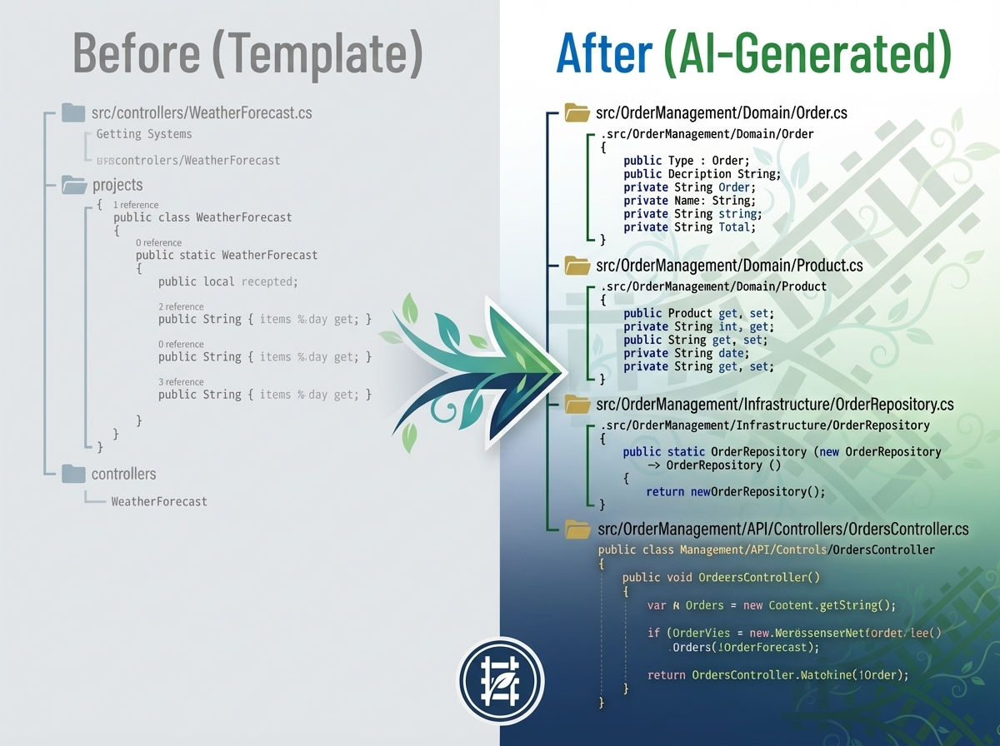
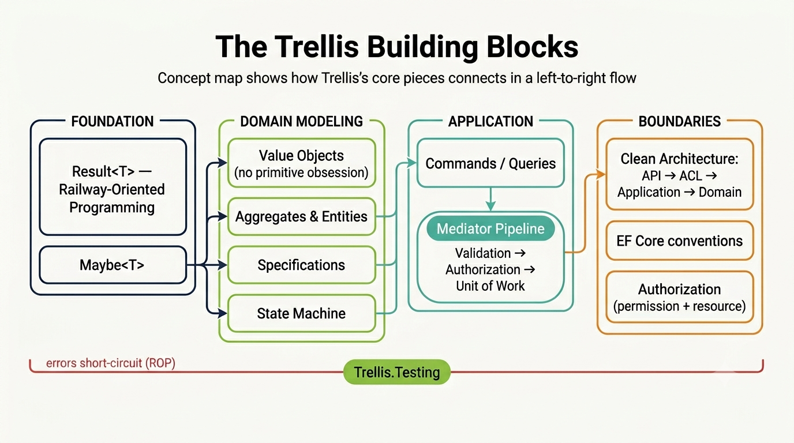

# Trellis Training Lab — Order Management

> **Learn to build a production-shaped enterprise service on the [Trellis](https://github.com/xavierjohn/Trellis) framework** by guiding an AI through a real business spec — then studying *exactly* what it built and *why* each pattern is there. By the end you'll be able to read, run, extend, and review an idiomatic Trellis service.
>
> 🧪 This same lab doubles as an **AI-consistency eval**. Running it across models measures how tightly Trellis steers them. That's a useful side effect — if you're here to *learn*, ignore it and follow the steps. The eval mechanics live at the end under [Running this as a consistency eval](#running-this-as-a-consistency-eval-optional).

---

## Who this is for

A C# developer who knows web APIs but is **new to Trellis**, and wants to see how the framework's building blocks fit together in a realistic service. You don't write the implementation by hand — you give an AI the spec and the framework's own conventions, let it build, and then **read the result as your textbook**. You learn the patterns by seeing them applied end-to-end, not from a wall of theory.

## What you'll build

The **Order Management** service: customers, products with inventory, and orders that move through a state machine (`Draft → Submitted → Approved → Shipped → Delivered`, with `Cancel`). It has role-based authorization, a versioned HTTP API, EF Core persistence, OpenTelemetry, and a full test suite — roughly 70 source files, all generated from one spec.

<p align="center">
  
</p>

## What you'll learn

By the end you'll understand, in working code, how Trellis shapes each of these — and *why*:

- **Clean Architecture** with an enforced dependency rule (`API → Anti-Corruption Layer → Application → Domain`).
- **Railway-Oriented Programming** — `Result<T>` / `Maybe<T>` instead of exceptions and nulls.
- **Domain modeling without primitive obsession** — value objects, smart enums, aggregates, entities, specifications.
- **A state machine** that makes illegal order transitions impossible.
- **CQRS** with a Mediator pipeline that handles validation, authorization, and transactions as cross-cutting behaviors.
- **EF Core the Trellis way** — convention-based mapping and a Unit-of-Work commit (handlers never call `SaveChanges`).
- **Authorization** by permission and by resource ownership — declared, not hand-rolled.
- **Testing** with `Trellis.Testing`'s `Result` / `Maybe` assertions.

---

## Core Trellis concepts you'll meet

Skim this once now; you'll *recognize* each pattern when you read the generated code, and the [guided tour](#guided-tour-of-the-reference-implementation) points you at the exact file for each. Don't memorize it — the goal is to know what to look for.

<p align="center">
  
</p>

| Concept | What it is | Why Trellis uses it | First see it in |
|---|---|---|---|
| **`Result<T>` + Railway-Oriented Programming** | A return type carrying either a value or an `Error`. Operations chain with `Bind` / `Map` / `Ensure`; the first failure short-circuits the rest. | Expected failures become **values, not exceptions** — explicit in signatures, trivially testable, no hidden control flow. | `Domain/src/Aggregates/Order.cs` |
| **`Maybe<T>`** | An explicit "optional" type. Absence is a value, not `null`. | The type system tells you a value may be missing, so there are no surprise `NullReferenceException`s. | `Customer.PhoneNumber` |
| **Value objects (no primitive obsession)** | `RequiredGuid<T>`, `RequiredString<T>`, `RequiredInt<T>`, `RequiredEnum<T>`, etc. Each validates itself via `TryCreate` returning a `Result`. | Invalid states become **unrepresentable**, and `CustomerId` can't be passed where an `OrderId` is expected. | `Domain/src/ValueObjects/` |
| **DDD building blocks** | `Aggregate<TId>`, `Entity<TId>`, `Specification<T>`. | Business rules live **in the domain**, not scattered across handlers; specifications are reusable, testable, EF-translatable predicates. | `Order`, `LineItem`, `OverdueOrderSpecification` |
| **State machine** | A `LazyStateMachine<TState, TTrigger>`; transitions are guarded and return a `Result`. | Illegal transitions (e.g. shipping a draft) are **impossible by construction**, not by `if` checks. | `Domain/src/Aggregates/Order.cs` |
| **CQRS + Mediator pipeline** | Each operation is a `Command`/`Query` with a handler; validation, authorization, and the transaction are **pipeline behaviors**. | Handlers stay thin and domain-focused; cross-cutting policy is applied uniformly and can't be forgotten. | `Application/src/Orders/` |
| **Clean Architecture** | Four projects; dependencies point inward. Repository **interfaces** live in Application; EF Core implementations live in the ACL (Dependency Inversion). | The domain stays pure and infrastructure is swappable; the ACL is an *outer* layer, not a layer between Application and Domain. | the four `*/src` projects |
| **Authorization** | `IAuthorize` (permissions) and `IAuthorizeResource<T>` (ownership), resolved by pipeline behaviors. | Authorization is **declarative metadata**, not `if (actor != owner)` checks buried in handlers. | `CancelOrderCommand` |
| **EF Core conventions + Unit of Work** | `ApplyTrellisConventions`, interceptors, and `AddTrellisUnitOfWork<TContext>` — the pipeline commits once at the end. | Almost zero mapping boilerplate, and **handlers never call `SaveChanges`** — the commit is atomic and framework-driven. | `Acl/src/` |
| **`Trellis.Testing`** | Assertions like `.Should().BeSuccess()`, `.Should().HaveValue()`, `.Should().BeNone()`, plus fakes. | Tests assert on `Result` / `Maybe` directly instead of unwrapping and null-checking. | `*/tests/` |

These three diagrams capture the spine of the service — refer back to them as you build:

<p align="center">
  
</p>
<p align="center">
  
</p>
<p align="center">
  
</p>

> 📚 **Where the deep reference lives:** the scaffold (next step) drops a set of `.github/trellis-api-*.md` files — the authoritative, package-synced API reference (`trellis-api-core.md`, `trellis-api-primitives.md`, `trellis-api-efcore.md`, `trellis-api-asp.md`, `trellis-api-authorization.md`, `trellis-api-statemachine.md`, `trellis-api-testing-reference.md`, `trellis-api-cookbook.md`, and more) — alongside `.github/copilot-instructions.md`, which tells the AI *how* to build with Trellis. You don't need to read them cover to cover; dip in when a concept above is unfamiliar.

---

## Prerequisites

- .NET 10 SDK
- VS Code or Visual Studio
- GitHub Copilot (Copilot Chat in VS Code) — or another AI model you want to drive the build
- The Trellis ASP template: `dotnet new install Trellis.AspTemplate`
- Docker Desktop *(optional — for the Aspire Dashboard telemetry viewer)*
- Basic C# and web-API familiarity

---

## The workflow at a glance

Every lab is the same 8 steps. Steps **4** and **8** are where the AI writes code; the rest is setup, verification, and learning.

<p align="center">
  
</p>

| Step | What happens | Time |
|------|-------------|------|
| 1 | Create the project directory | 1 min |
| 2 | Start the Aspire Dashboard | 2 min |
| 3 | Scaffold with `dotnet new trellis-asp` | 2 min |
| 4 | Paste the spec into Copilot — **AI implements the service** | 10–30 min |
| 5 | Manual smoke test | 5 min |
| 6 | Read & review the generated code *(this is the learning)* | 5–15 min |
| 7 | AI generates `TRELLIS_FEEDBACK.md` | 2 min |
| 8 | **AI adds a feature** (Order Returns) to prove the architecture evolves | 10–15 min |

---

## Step 1: Create a project directory

```bash
mkdir OrderManagement
cd OrderManagement
git init
```

## Step 2: Start the Aspire Dashboard

The Aspire Dashboard shows traces, metrics, and structured logs as you test — your window into what the running service does.

```powershell
docker run --rm -it -d -p 18888:18888 -p 4317:18889 -e ASPIRE_DASHBOARD_UNSECURED_ALLOW_ANONYMOUS=true --name aspire-dashboard mcr.microsoft.com/dotnet/aspire-dashboard:latest
```

| Port | Purpose |
|------|---------|
| `18888` | Dashboard UI — open http://localhost:18888 |
| `4317` | OTLP gRPC receiver — apps send telemetry here |

Verify it's running: `docker ps`.

## Step 3: Scaffold with the template

```bash
dotnet new install Trellis.AspTemplate     # first time only
dotnet new trellis-asp -n OrderManagement --authorName "Your Name"
```

This creates the full solution: the four-project Clean Architecture layout, the build system (`Directory.Build.props`, `Directory.Packages.props`, `build/test.props`), test infrastructure, a `.gitignore`, a **working sample service** (a small Todo sample app you'll replace), and — importantly for the AI — `.github/copilot-instructions.md` plus the `.github/trellis-api-*.md` reference files.

Verify the scaffold builds and its sample tests pass, then commit:

```bash
dotnet build
dotnet test
git add -A && git commit -m "Scaffold with Trellis template"
```

> **Why scaffold instead of letting the AI create everything?** The template owns the boilerplate — project structure, package wiring, DI, global usings — so the AI spends its budget on **business logic**, not plumbing, and every run starts from an identical, known-good baseline. The `copilot-instructions.md` + `trellis-api-*.md` files are what make the AI's output idiomatic and consistent.

## Step 4: Implement the service

Open Copilot Chat, paste the **entire contents** of [`specs/order-management.md`](../specs/order-management.md) as context, then prompt:

> Implement the Order Management service according to the spec above. Replace the existing sample code with the Order Management domain.

**Alternate (SQL Server):** add *"Use SQL Server instead of SQLite. Apply EF Core migrations from a separate console app instead of on web-service startup."*

**Let the AI work.** Don't intervene unless it asks a clarifying question — if it does, answer *"Follow the spec and copilot instructions."* When it finishes:

```bash
dotnet build
dotnet test
```

If there are build or test errors, paste them back and let Copilot fix them. Repeat until clean.

> **What just happened?** The AI read the *business* requirements from the spec and the *implementation* conventions from `copilot-instructions.md`, then built the service layer by layer in build order (`Domain → Application → Acl → Api → Tests`), compiling between layers because Trellis source generators emit code each build. You'll see the result in Step 6.

## Step 5: Manual smoke test

Run the service with telemetry pointed at the dashboard:

```powershell
$env:OTEL_EXPORTER_OTLP_ENDPOINT = "http://localhost:4317"
$env:OTEL_EXPORTER_OTLP_PROTOCOL = "grpc"
dotnet run --project Api/src
```

(Bash: `OTEL_EXPORTER_OTLP_ENDPOINT=http://localhost:4317 OTEL_EXPORTER_OTLP_PROTOCOL=grpc dotnet run --project Api/src`)

Open the **Aspire Dashboard** (http://localhost:18888) and watch the traces while you exercise the API with the generated `.http` file (the [REST Client](https://marketplace.visualstudio.com/items?itemName=humao.rest-client) extension). Walk the happy path *and* the guardrails:

1. **Create a customer** (as SalesRep) → `201 Created` + Location header
2. **Create a customer without a phone** → `201 Created`, phone absent
3. **Create a product** (as WarehouseManager) → `201 Created`
4. **Add stock** → `200`, stock updated
5. **Create a draft order** (as SalesRep) → `201 Created`, status `Draft`
6. **Submit the order** → `200`, status `Submitted` (stock reserved)
7. **Cancel as a *different* SalesRep** → `403 Forbidden` (not the owner)
8. **Approve without permission** → `403 Forbidden`
9. **Approve as WarehouseManager** → `200`
10. **Cancel as the original creator** → `200`, stock restored
11. **Health check** (`/health`) → `200`

Each line maps to a concept: 7–8 exercise authorization, 6 & 10 exercise the state machine and stock side effects, 2 exercises `Maybe<T>`.

## Step 6: Read and review the generated code — *this is the learning*

Don't skip this — **reading the output is the point of the lab.** Use the [Guided tour](#guided-tour-of-the-reference-implementation) below to walk the code in a sensible order, and check it against [What "good" looks like](#what-good-looks-like-and-why). Then commit:

```bash
git add -A && git commit -m "Implement Order Management Service with Trellis"
```

## Step 7: Generate Trellis feedback

Ask Copilot to reflect — this is how friction in the framework gets surfaced:

> Review the entire codebase you just built. Generate a `TRELLIS_FEEDBACK.md` following the format in the copilot instructions. Be specific about friction points, workarounds, or missing features, and also note what worked well.

Verify it contains severity-ranked friction points (each with context + a suggested improvement), a "What Worked Well" section, and any copilot-instructions ambiguities. Commit it.

## Step 8: Add a feature — Order Returns

> **Why this step matters most.** Real services *change*. This step proves the architecture you just built absorbs a new requirement without regressions — the single most important real-world property. It's also the step that most cleanly separates a model that *pattern-matched* the spec from one that *understood* the design.

**The new rule:** customers can return delivered orders within 30 days. Paste this into the **same** Copilot conversation:

> **New requirement: Order Returns**
>
> Customers can now return delivered orders. Add the following to the existing service:
>
> **Domain:**
> - Add `Returned` to the `OrderStatus` enum
> - Add a `ReturnReason` value object — required string, 10–500 characters
> - Add `DeliveredAt` and `ReturnedAt` as `partial Maybe<DateTime>` on `Order` (set during the Delivered and Return transitions)
> - Add transition `Delivered → Returned`
>   - Precondition: delivered within the last 30 days (`DeliveredAt` exists and ≤ 30 days ago)
>   - Side effect: release reserved stock for each line item (same as cancel)
>   - Side effect: set `ReturnedAt` to now
>   - Domain event: `OrderReturnedEvent(OrderId, CustomerId, ReturnReason, ReturnedAt)`
> - Shipped and Cancelled orders cannot be returned; already-returned orders cannot be returned again
>
> **Application:** add `ReturnOrderCommand` (permission `orders:return`) + handler; grant `orders:return` to SalesRep.
>
> **API:** `POST /api/orders/{id}/return` with body `{ "reason": "..." }` → 200 on success, 400 on expired window / invalid transition, 404 if not found, 403 if missing permission.
>
> **Tests:** domain (return within window, after 30 days, from non-Delivered status, stock released), application (happy path, missing permission), API (HTTP round-trip, 400 for expired window).

Then verify **zero regressions**:

```bash
dotnet build     # 0 errors
dotnet test      # all previous tests pass + new return tests pass
git add -A && git commit -m "Add Order Returns feature"
```

Watch for whether the AI **reuses** the cancel stock-release pattern, keeps the new time rule **testable** (injectable clock), and leaves every existing test green. The supplementary [feature-addition checklist](#supplementary-feature-addition-step-8) lists exactly what to look for.

---

## Guided tour of the reference implementation

You don't have to run anything to learn from this — a complete, passing reference build lives in [`after/OrderManagement/`](../after/OrderManagement/). Read it in this order; at each stop, notice the **idiom** in the right-hand column.

| Read | Notice |
|---|---|
| `Domain/src/ValueObjects/` (`CustomerId.cs`, `Sku.cs`, `UnitPrice.cs`, …) | Every domain concept is its own type with a private ctor + `TryCreate`. No raw `Guid`/`string`/`decimal` crosses a domain boundary. |
| `Domain/src/ValueObjects/OrderStatus.cs` | A `RequiredEnum<T>` smart enum — not a C# `enum`. It carries behavior and converts cleanly for JSON and EF Core. |
| `Domain/src/Aggregates/Order.cs` | The aggregate: a `LazyStateMachine` configures guarded transitions; methods like `Submit`/`Cancel` return `Result` and thread side effects with `Bind`/`Map`/`Tap`. This is ROP and the state machine in one file. |
| `Domain/src/Specifications/OverdueOrderSpecification.cs` | A reusable, testable, EF-translatable predicate — business rules as objects. |
| `Application/src/Orders/` | Commands/queries + handlers; repository **interfaces** (`IOrderRepository`) live here. Note `CancelOrderCommand` carries `IAuthorize` + resource-authorization metadata — the handler has no `if (actor != owner)`. |
| `Acl/src/` (`AppDbContext.cs`, `*Configuration.cs`, `*Repository.cs`, `DependencyInjection.cs`) | `ApplyTrellisConventions` (almost no manual mapping), repository **implementations** of the Application interfaces (Dependency Inversion), and `AddTrellisUnitOfWork<AppDbContext>` — the commit is wired here, not in handlers. |
| `Api/src/2026-11-12/` (`Controllers/`, `Models/`) | Thin controllers that bind value objects, send the command, and map the `Result` to an HTTP response + DTO. Versioning is by namespace/folder. |
| `*/tests/` | `Trellis.Testing` assertions (`.Should().BeSuccess()`, `.Should().HaveValue()`), state-machine transition tests, authorization tests, and full HTTP round-trips. |

---

## What "good" looks like (and why)

These are the properties of a correct Trellis implementation — treat them as your **definition of done** for Step 6. For each, the *why* is the lesson; the *how to check* is how you confirm it. (When you use this lab as an eval, these same rows become scored criteria — see the [eval section](#running-this-as-a-consistency-eval-optional). Criteria marked **(T)** are provided by the template, so they verify the AI *preserved* the scaffold rather than broke it.)

The Order Management lab scores against **57 criteria across five levels**; a passing implementation reaches **52+/57**. The Step 8 feature-addition check is supplementary and scored separately.

### Level 1 — Structural (18) · *Are the right building blocks present?*

| Property | How to check | Why it matters |
|---|---|---|
| Value objects exist | `CustomerId`, `OrderId`, `ProductId`, `LineItemId`, `Sku`, `UnitPrice`, `ShippingAddress`, `FirstName`, `LastName`, `ProductName`, `Quantity` are distinct types | No primitive obsession; the type system encodes domain identity |
| Value objects use `TryCreate` | each returns `Result<T>` from a private ctor | Validity is established once, at construction |
| Aggregates inherit `Aggregate<TId>` | `Customer`, `Product`, `Order` | DDD identity, equality, and domain-event support |
| Line items are entities | `LineItem : Entity<LineItemId>` | Identity within the aggregate boundary |
| State machine uses a guarded machine | `Order` transitions via `LazyStateMachine` + `FireResult` | Transitions are validated centrally |
| Transitions return `Result` | not `void`/throw | Illegal transitions surface as values |
| Domain events defined | all 5 events from the spec | The domain announces what happened |
| Specification exists | `OverdueOrderSpecification : Specification<Order>` | Reusable, translatable business rule |
| CQRS used | every operation is a Command/Query + handler via Mediator | Uniform, testable application layer |
| Authorization on commands | commands implement `IAuthorize`; `CancelOrderCommand` adds resource authorization | Declarative, not hand-rolled |
| Permissions as constants | a `Permissions` class in Domain | One source of truth for permission strings |
| Repository interfaces in Application | `I*Repository` in Application, **not** Domain | Domain stays persistence-agnostic |
| EF Core in the ACL **(T)** | `DbContext` + repo impls in `Acl` | Infrastructure is an outer layer |
| `ApplyTrellisConventions` used **(T)** | no manual `HasConversion()` | Convention over boilerplate |
| Project structure matches template **(T)** | the four-project layout | Consistent, navigable architecture |
| No exceptions for control flow | zero `try/catch` in Domain/Application | Failures are values, not throws |
| `build/test.props` shared **(T)** | present; no `GlobalUsings.cs` in test projects | Centralized test config |
| No primitive obsession | no raw `Guid`/`string` params in domain methods | Validity at the type level |

### Level 2 — Behavioral (13) · *Does the business logic work?*

| Property | Why it matters |
|---|---|
| Submit validates stock before reserving | Inventory integrity |
| Cancel from Submitted/Approved releases stock; **Cancel from Draft does not** | Stock is only reserved at Submit, so a Draft cancel has nothing to release |
| Line-item price is a snapshot at creation | Orders don't silently re-price |
| Duplicate product in an order is rejected | One line per product |
| The last line item can't be removed | An order always has content |
| Error taxonomy is correct | `Validation` / `NotFound` / `Conflict` / `Forbidden` used per the spec |
| Order total = Σ(unit price × quantity) | Correct money math |
| Overdue spec checks Submitted + 7-day threshold, SQL-translatable | Queryable business rule |
| IDs use `RequiredGuid` with `Guid.CreateVersion7()` | Sortable, index-friendly identifiers |
| `Customer.PhoneNumber` is `Maybe<PhoneNumber>` (nullable column) | Optionality is explicit |
| Draft-order product load is **batched** (`FindManyByIdAsync`), not N+1 | One query, not one per line; and **not** parallelized on a shared `DbContext` (cookbook Recipe 21 — it races EF Core's change tracker) |
| Cancel checks `actor == owner` **or** admin | Resource-based authorization |
| Handlers/repositories never call `SaveChanges*` | Under `AddTrellisUnitOfWork<TContext>` the pipeline commits exactly once |

### Level 3 — Architecture & API (13) · *Is the outside correct?*

| Property | Why it matters |
|---|---|
| Four Clean-Architecture projects, dependencies inward | The dependency rule holds |
| Domain references only Trellis + the runtime | Domain purity |
| Mediator pipeline behaviors registered | Validation/auth/UoW apply uniformly |
| `IActorProvider` registered (reads `X-Test-Actor`) | Testable identity |
| One DI extension per layer, wired in `Program.cs` | Clear composition root |
| All 14 endpoints present with correct verbs/paths | API matches the spec |
| Namespace-based API versioning | Versions are isolated by folder |
| RFC 9457 Problem Details for errors | Standard error shape |
| 201 + Location on creation | Correct REST semantics |
| `/health` endpoint present | Operability |
| DTOs in the versioned `Models/` folder, not domain types | Presentation/domain separation |
| `IEntityTypeConfiguration` classes in the ACL | Mapping lives with infrastructure |
| `EnsureCreated()` in development, no migrations | Simple local startup |

### Level 4 — Tests (9) · *Is it proven?*

Domain tests per aggregate; happy-path and error-path tests; every valid **and** invalid state transition; the overdue specification; authorization (permission-denied + ownership); `Maybe` assertions (`.Should().HaveValue()` / `.Should().BeNone()`); API round-trips (routing, versioning, status codes, 403); and `Trellis.Testing` (`.Should().BeSuccess()` / `.BeFailure()`) used throughout. *Why:* the tests are how you (and the eval) know the behavior above actually holds.

### Level 5 — Feedback (4) · *Did the build improve the framework?*

`TRELLIS_FEEDBACK.md` exists; friction points are specific (category, severity, context, workaround, suggestion); a "What Worked Well" section is present; and the AI flags any ambiguity in the copilot instructions. *Why:* the lab is a feedback loop — friction surfaced here is how Trellis gets tighter.

---

## Running this as a consistency eval *(optional)*

Everything above teaches one person to build one service. The same lab, run **many times across models**, measures something else: **how consistently Trellis steers different AIs to the same design.** If you only want to learn Trellis, you can stop here.

> **What you're measuring:** not whether an AI can write code, but whether **Trellis constrains it enough** that independent runs produce the same architecture, patterns, and error handling. Where runs diverge, Trellis needs a tighter building block. (For a separate, framework-neutral "with vs. without Trellis" study, see [`trellis-ai-benchmark`](https://github.com/xavierjohn/trellis-ai-benchmark).)

**Procedure:** run Steps 1–8 identically in N fresh sessions (new repo + new Copilot conversation each time). Use the same Step 4 prompt verbatim; don't fix the AI's mistakes — score them. After each run, mark every criterion in [What "good" looks like](#what-good-looks-like-and-why) Pass/Fail.

**Scoring:** a criterion *counts* for a model if it passes. Sum per level for a total out of 57; **52+/57 passes**. For cross-run consistency, track how many of N runs pass each criterion and treat anything below ~70% as a framework/instruction gap to close.

**Scriptable structural checks** (run from the service root):

```bash
grep -rnw "catch" Domain/src Application/src --include="*.cs" | wc -l ;                  # 0 — no exception handling on the happy path
grep -rn "Guid " Domain/src --include="*.cs" | grep -vE "RequiredGuid|ValidateAdditional" | wc -l ;  # 0 — generated VO validation hooks excluded
grep -r "HasConversion" Acl/src --include="*.cs" | wc -l ;                               # 0 — conventions, not manual converters
grep -r "ApplyTrellisConventions" Acl/src --include="*.cs" | wc -l ;                     # 1
grep -r "ICommand<Result" Application/src --include="*.cs" | wc -l ;                     # 11 — one per command
grep -rE "\[Http" Api/src --include="*.cs" | wc -l ;                                     # 16 — 14 spec endpoints + 2 hidden GET-by-id helper routes
grep -rn "SaveChanges" Application/src Acl/src --include="*.cs" | wc -l ;                # only XML-doc mentions; zero actual calls (the UoW behavior commits)
```

### Supplementary: feature-addition (Step 8)

Score these separately from the core 57 — they measure whether the AI can **evolve** the codebase, not just create it.

- **Zero regressions** — every pre-existing test still passes.
- `Returned` added to `OrderStatus`; state machine gains `Delivered → Returned` only.
- `ReturnReason` value object with `TryCreate` (10–500 chars).
- `DeliveredAt` / `ReturnedAt` are `Maybe<DateTime>`, set on the right transitions.
- 30-day window enforced and **testable** (injectable clock).
- Stock released on return (reusing the cancel pattern).
- `OrderReturnedEvent` raised; `orders:return` permission added; `ReturnOrderCommand` wired through the full pipeline.
- `POST /api/orders/{id}/return` with correct versioning and status codes; domain + API tests added.

---

## Trellis packages exercised

| Package | How this lab exercises it |
|---------|--------------------------|
| `Trellis.Core` | `Result<T>` on every operation, `Maybe<T>` for optionals, `Error` types, `Bind`/`Map`/`Tap`/`Ensure`/`Combine`; the DDD primitives (`Aggregate<TId>`, `Entity<TId>`, `Specification<T>`, `ValueObject`, `RequiredString<TSelf>`, `RequiredGuid<TSelf>`, …) and the source generators that emit `TryCreate`/equality/JSON converters. |
| `Trellis.Primitives` | Ready-made value objects such as `EmailAddress`, `PhoneNumber`, `Money`. |
| `Trellis.StateMachine` | The `Order` lifecycle via `LazyStateMachine` + `FireResult()`. |
| `Trellis.Mediator` | Commands/queries plus `ValidationBehavior`, `AuthorizationBehavior`, and the Unit-of-Work behavior. |
| `Trellis.Authorization` | `Actor`, `IActorProvider`, `IAuthorize`, `IAuthorizeResource`, `IIdentifyResource`. |
| `Trellis.EntityFrameworkCore` | `ApplyTrellisConventions`, `AddTrellisUnitOfWork<T>`, `FirstOrDefaultMaybeAsync`, `.Where(spec)`. |
| `Trellis.Asp` | Result-to-HTTP mapping, 201+Location, Problem Details, scalar value binding, actor providers. |
| `Trellis.Analyzers` | Compile-time `Result`/`Maybe`/EF-Core correctness checks. |
| `Trellis.Testing` | `.Should().BeSuccess()`/`.BeFailure()`/`.HaveValue()`/`.BeNone()`, `FakeRepository`, builders. |

---

## Where to go next

- **Try another system shape.** The [Subscription Reminder Worker](training-lab-worker.md) lab teaches the non-HTTP `BackgroundService` shape (scheduled work, idempotency, actor composition). The [URL Shortener](training-lab-url-shortener.md) lab covers an unversioned redirect host with `Idempotency-Key` and ETags.
- **Read the framework.** [`xavierjohn/Trellis`](https://github.com/xavierjohn/Trellis) is the source for every concept above.
- **Study the reference build** any time: [`after/OrderManagement/`](../after/OrderManagement/).
